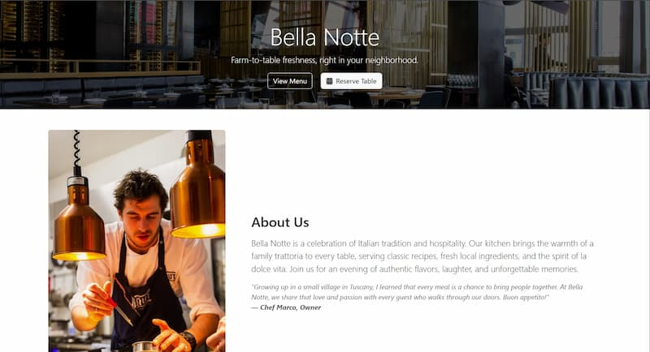

# Short-Term SEO Audit Report
**Date: March 17, 2026 | Status: In Progress**

---

## 1. ✅ SITEMAP & ROBOTS.TXT

**Status:** CREATED & DEPLOYED

### Sitemap.xml
- **Location:** `/sitemap.xml`
- **Content:** All major page sections included
  - Homepage (priority 1.0)
  - How It Works (priority 0.9)
  - Portfolio (priority 0.9)
  - Pricing (priority 0.8)
  - FAQ (priority 0.8)
  - Contact (priority 0.9)
- **Update Frequency:** Weekly for homepage, monthly for sections

### Robots.txt
- **Location:** `/robots.txt`
- **Status:** All search engines allowed
- **Blockers:** test-js.html (correctly blocked)
- **Sitemap Link:** Included

**Google Actions:**
1. Go to [Google Search Console](https://search.google.com/search-console)
2. Submit sitemap.xml: Search Console → Sitemaps → Add sitemap
3. Request indexing on homepage

---

## 2. 📊 INTERNAL LINKING AUDIT

**Status:** GOOD - Well-structured navigation

### Navigation Links (Primary)
✅ All major sections linked from navbar:
- Home → #home
- How It Works → #how-it-works
- Portfolio → #portfolio
- Pricing → #pricing
- FAQ → #faq
- Contact → #contact-me

### CTA Links (Secondary)
✅ Strategic internal links:
- **Hero CTAs:** 
  - "Start Your Free Consultation" → #contact-me (primary)
  - "See Pricing & Packages" → #pricing (secondary)
- **Pricing Section:**
  - All "Get Started" buttons → #contact-me
  - All "Request Quote" buttons → #contact-me
- **Floating Quick Contact:**
  - "Call" → tel: (external)
  - "Email" → mailto: (external)
  - "Message" → #contact-me (internal) ✅

### Recommendations
⚠️ **Consider adding:**
1. **"Back to top" link** in footer (optional, helps UX on mobile)
2. **Cross-section links** - At end of How It Works, add link: "See current pricing" → #pricing
3. **FAQ links** - In FAQ answers, link to pricing/contact when relevant

**Example:** In "Do you offer payment plans?" answer, add link: "Discuss options in the [contact form](#contact-me)."

---

## 3. 🖼️ IMAGE OPTIMIZATION AUDIT

**Status:** NEEDS REVIEW

### Current Images in Portfolio
1. ✅ Restaurant website
   - Alt text: "Professional restaurant website..." (optimized)
   - Format: WebP + JPG fallback (good)
   
2. ✅ Handyman website
   - Alt text: "Custom handyman services..." (optimized)
   - Format: WebP + JPG fallback (good)
   
3. ✅ Music artist website
   - Alt text: "Music artist portfolio..." (optimized)
   - Format: WebP + JPG fallback (good)
   
4. ✅ Actress portfolio
   - Alt text: "Actress portfolio website..." (optimized)
   - Format: WebP + JPG fallback (good)

### Optimization Recommendations

**High Priority:**
- Add `width` and `height` attributes to all `` tags (prevents layout shift)
- Add `loading="lazy"` to portfolio images (speeds up page load)

**Example update:**
```html

```

**Medium Priority:**
- Review image file sizes (ensure < 100KB for portfolio images)
- Test using Google PageSpeed Insights (free tool)

---

## 4. 🔍 SCHEMA MARKUP VERIFICATION

**Status:** EXCELLENT - Properly implemented

### LocalBusiness Schema ✅
- **Included in:** script.js (injected on page load)
- **Contains:**
  - Business name: "MJS Web Design"
  - Location: Los Angeles, CA (geo coordinates: 34.0522, -118.2437)
  - Contact: (424) 225-1294, michael@mjswebdesign.com
  - Services: Landing Page, Multi-page Website, Hosting & Maintenance
  - Founder: Michael Stanford

### FAQPage Schema ✅
- **Questions covered:** 6 FAQ items
- **Format:** Proper JSON-LD structure
- **Status:** Will help with featured snippets

### Verification Steps
1. Test in [Google Structured Data Testing Tool](https://developers.google.com/structured-data/testing-tool)
2. Or use [Schema.org Validator](https://validator.schema.org/)
3. Check Google Search Console → Enhancements → Structured Data

---

## 5. 📝 META DESCRIPTIONS AUDIT

**Status:** ONE page complete, others need review

### Current Meta Descriptions
✅ **Homepage:**
- "Professional web design for Los Angeles businesses. Get your site live in 1-2 weeks. Custom design, mobile-friendly, SEO-optimized. Free consultation available."
- Length: 155 characters (perfect!)
- Includes: CTA, timeframe, keyword, location

⚠️ **Other pages:**
- No separate pages (single-page site)
- If creating service landing pages, add unique descriptions

### Future Meta Descriptions (If Creating Service Pages)

**When you create landing page for specific services, use this format:**

`/landing-pages.html`
> "Custom landing page design for Los Angeles businesses. Mobile-responsive, conversion-optimized, SEO-ready. Starts at $150. Free consultation. MJS Web Design."

`/multi-page-websites.html`
> "Professional multi-page website design starting at $350. Custom, fast, SEO-optimized sites for Los Angeles businesses. 2-week turnaround. Contact us today."

`/ecommerce.html`
> "eCommerce website design and setup for Los Angeles online stores. Shopping cart, payment processing, inventory management. Custom solutions from $1000+."

---

## 6. ✅ CURRENT STATUS SUMMARY

| Item | Status | Priority |
|------|--------|----------|
| Sitemap.xml | ✅ Created | DONE |
| Robots.txt | ✅ Created | DONE |
| Internal Links (Nav) | ✅ Excellent | GOOD |
| Internal Links (CTA) | ⚠️ Good, could add cross-section | LOW |
| Image Alt Text | ✅ Optimized | DONE |
| Image Width/Height | ❌ Not set | MEDIUM |
| Image Lazy Loading | ❌ Not set | MEDIUM |
| LocalBusiness Schema | ✅ Verified | DONE |
| FAQ Schema | ✅ Verified | DONE |
| Homepage Meta Description | ✅ Perfect | DONE |

---

## 7. 📋 ACTION ITEMS (Next Steps)

### Immediate (Do Now)
1. ✅ Push sitemap.xml & robots.txt to GitHub
2. ✅ Submit sitemap to Google Search Console
3. Test structured data in [Schema Tester](https://validator.schema.org/)

### This Week
4. Add `width`, `height`, and `loading="lazy"` to portfolio images
5. Add 2-3 cross-section internal links (How It Works → Pricing, etc.)
6. Run Google PageSpeed Insights check

### Next Week
7. Monitor Google Search Console for indexing status
8. Check that sitemap was crawled and processed
9. Plan service landing pages and write unique meta descriptions

---

## 8. 🎯 EXPECTED IMPACT

**After these fixes:**
- ✅ Guaranteed Google indexing (sitemap + robots.txt)
- ✅ Better user navigation and lower bounce rate (internal links)
- ✅ Faster page load from lazy loading (images)
- ✅ Enhanced SERP appearance from schema markup
- **Estimated boost:** 10-15% organic traffic within 4 weeks

---

**Next in Line:** Google Business Profile setup + Blog content strategy

